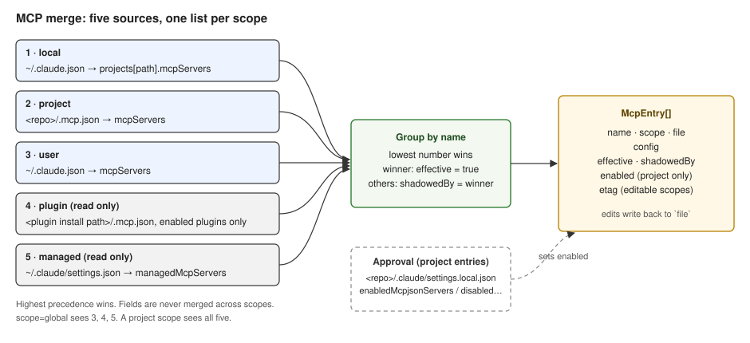

# MCP resource

Status: Stable · Built · 2026-09-15 · The merged list of MCP servers a scope sees, where each one comes from, and how to change it.

## At a glance

MCP (Model Context Protocol) servers are the tools Claude Code can call. A server can be defined
in five places, and Claude Code applies a fixed precedence when the same name appears in more than
one. cluide shows one list per scope with every entry tagged by where it lives, marks the entry
that wins, and lists the ones it shadows underneath. Editing writes back to the file the entry came
from. Servers a project's `.mcp.json` brings in need the user's approval before Claude Code runs
them; that approval is a toggle here.

## Diagram

## Sources

As documented at https://code.claude.com/docs/en/mcp. Precedence is highest first; only the
highest definition is used, fields are never merged across scopes.

| Precedence | Scope | File | Editable | Present for `scope=global` |
|---|---|---|---|---|
| 1 | `local` | `~/.claude.json` → `projects[path].mcpServers` | yes | no |
| 2 | `project` | `<repo>/.mcp.json` → `mcpServers` | yes | no |
| 3 | `user` | `~/.claude.json` → `mcpServers` | yes | yes |
| 4 | `plugin` | `<plugin install path>/.mcp.json`, for every enabled plugin | no | yes |
| 5 | `managed` | `~/.claude/settings.json` → `managedMcpServers` | no | yes |

Plugin servers are listed as `plugin_<plugin>_<server>`, the prefix Claude Code puts on their tools
(`mcp__plugin_acme-mcp_es__search` is tool `search` of server `es` from plugin `acme-mcp`).
A plugin's servers appear only when the plugin is enabled; see [`plugins.md`](./plugins.md).

## Approval of project servers

The keys `enabledMcpjsonServers` and `disabledMcpjsonServers` live in settings files. Verified on
the reference machine: Claude Code records them in `<repo>/.claude/settings.local.json`. The toggle
reads the merged settings for the scope (shared, then local, then the leftover keys on
`~/.claude.json` → `projects[path]`) and writes to `<repo>/.claude/settings.local.json`, creating
it if needed. `enableAllProjectMcpServers: true` in any settings file makes every project server
`approved`.

| `enabled` value | Meaning |
|---|---|
| `true` | Approved, or `enableAllProjectMcpServers` is set |
| `false` | Rejected |
| `null` | Not applicable: the entry is not a `project` entry |

A project entry that is neither approved nor rejected reads as `false`; Claude Code would prompt
for it at session start.

## Endpoints

| Method and path | Body | Response |
|---|---|---|
| `GET /api/mcp?scope` | | `McpList` |
| `PUT /api/mcp` | `{ scope, target, name, config, etag? }` | `{ etag, diff }` |
| `DELETE /api/mcp?scope&target&name&etag` | | `204` |
| `POST /api/mcp/approval` | `{ scope, name, enabled }` | `{ etag, diff }` |

`target` is `local`, `project` or `user` and names the file to write. `PUT` creates or replaces
the entry `name` in that file. The etag is the hash of that file's `mcpServers` slice.
`POST /api/mcp/approval` is only valid for a `project` entry and a project scope.

A file the list reads that exists but does not parse is skipped: it appears in `errors` with its path and
the parse message, and every other source is returned as usual — except a `~/.claude.json` that does
not parse, which still answers `422` for a project scope, because the scope guard needs that file to
validate the scope. Writes to that file still answer `422`, since a file that cannot be parsed cannot
be patched. Changes:
[`2026-09-15-pre-release-refinements.md`](../../adr/2026-09-15-pre-release-refinements.md).

## Shapes

| `McpList` field | Type | Meaning |
|---|---|---|
| `entries` | `McpEntry[]` | Every server from the sources that parsed |
| `errors` | `McpSourceError[]` | One per source file that exists but does not parse; empty when all parse |

| `McpSourceError` field | Type | Meaning |
|---|---|---|
| `file` | string | Absolute path of the file |
| `message` | string | `<basename> is not valid JSON` |

| `McpEntry` field | Type | Meaning |
|---|---|---|
| `name` | string | Server name as configured |
| `scope` | `local`, `project`, `user`, `plugin`, `managed` | Where this definition lives |
| `file` | string | Absolute path of that file |
| `config` | `McpConfig` | The definition as stored |
| `effective` | boolean | This entry wins precedence for its name |
| `shadowedBy` | string or null | The `scope` of the winning entry when `effective` is false |
| `enabled` | boolean or null | Approval state, project entries only |
| `etag` | string or null | Hash of the source file's `mcpServers` slice; null for read-only scopes |

| `McpConfig` | Fields |
|---|---|
| stdio | `command`, `args?`, `env?`; `type` absent or `"stdio"` |
| http | `type: "http"`, `url`, `headers?` |
| sse | `type: "sse"`, `url`, `headers?` |

The resource stores whatever object the client sends under `config` after checking it has either a
`command` or a `url`; it does not otherwise validate, so a new transport Claude Code adds keeps
working.

## Open questions

None.
