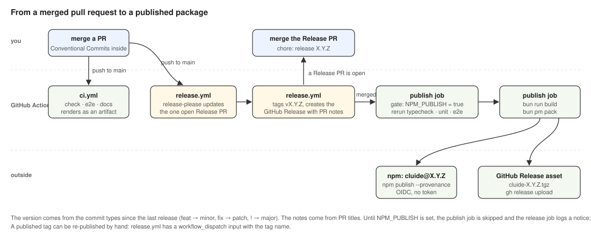

# CI and releases

Status: Stable · Built · 2026-09-13 · What runs on every pull request, how a release is cut from a release pull request, how the npm package is published, and what changes when the repository goes public.

## At a glance

Every pull request and every push to `main` runs three checks in parallel: typecheck with the unit
tests, the Playwright suite against a seeded temporary home, and the docs checks. A release is
never cut by hand: a bot keeps one release pull request open on `main`, with the next version
computed from the Conventional Commits since the last release and the notes taken from pull
request titles. Merging that pull request tags the version, creates the GitHub Release, and runs
the publish job, which reruns every check on the tagged commit, builds the page, publishes
`cluide` to npm through trusted publishing, and attaches the packed tarball to the release. Until
the repository is public, a variable keeps the npm step off and releases exist on GitHub only.

## Diagram

## Workflows

| File | Trigger | Jobs |
|---|---|---|
| `.github/workflows/ci.yml` | `pull_request` to `main`, `push` to `main` | `check`, `e2e`, `docs`, in parallel; a newer push cancels the older run of the same ref |
| `.github/workflows/release.yml` | `push` to `main`; `workflow_dispatch` with a `tag` input | `release` (release-please), then `publish` when a release was created, or for the given tag; runs queue behind each other and are never cancelled |
| `.github/workflows/audit.yml` | every Monday 06:00 UTC; `workflow_dispatch` | `bun audit` |

Every job runs on `ubuntu-latest`, installs Bun from the `packageManager` field of `package.json`
(`bun@1.3.14`), and installs with `bun install --frozen-lockfile`, so a lockfile that does not
match `package.json` fails instead of being rewritten. Actions are pinned to a commit SHA with the
version in a comment; Dependabot moves both. Permissions default to `contents: read` and each job
adds only what it needs.

## CI jobs

| Job | Runs | Artifacts | Proves |
|---|---|---|---|
| `check` | `bun run typecheck`, `bun run lint`, `bun run test` | | Both tsconfigs compile; biome's format, import order and lint rules hold; the unit tests pass against a temporary home |
| `e2e` | `bun run e2e` | `renders` (every run, 14 days), `e2e-results` (on failure) | The build works and the Playwright suite passes in the runner's Google Chrome; every pull request has its screenshots |
| `docs` | `bun run check-docs` | | Every relative link under `docs/` and in `CLAUDE.md` resolves; every spec file's `Status:` line has the shape in [`spec-discipline.md`](../../../.claude/rules/always-on/spec-discipline.md); no forbidden name appears in the tree |

The forbidden names are not in the repository. `scripts/check-docs.ts` reads the repository
variable `FORBIDDEN_NAMES` (comma-separated, matched as whole words, case-insensitive) and skips that
check with a notice when the variable is unset, so a fork or a fresh clone still passes.

## Release

The tool is release-please, in manifest mode: `.release-please-config.json` and
`.release-please-manifest.json` at the root.

| Setting | Value | Why |
|---|---|---|
| release type | `node` | bumps `package.json` and writes `CHANGELOG.md` |
| version | from the commit types since the last release: `feat` → minor, `fix` → patch, `!` or `BREAKING CHANGE` → major; while the major is 0, a breaking change bumps the minor; any other type bumps the patch | one source of truth: the commits the hook already checks |
| notes | GitHub's generated notes from pull request titles, categorised by `.github/release.yml` | pull requests merge with a merge commit, so per-task commits stay in history without doubling the changelog; release-please writes the same notes into `CHANGELOG.md` and the release body, so the two never differ |
| release pull request title | `chore: release X.Y.Z` | Conventional Commits, no scope |
| tag | `vX.Y.Z` | manifest mode would otherwise tag `cluide-vX.Y.Z`, so the config sets `include-component-in-tag` to `false` |
| first release | `0.1.0`, set by `initial-version` in the config, which applies only while no release exists; the manifest starts at `0.0.0`, which means nothing has been released | |

The release pull request only ever changes `package.json`, `CHANGELOG.md` and the manifest.
`bun.lock` does not record the root package's version, so the lockfile stays untouched. The bot's
pull request gets no CI run of its own, because GitHub does not start workflows for events the
Actions token creates; the publish job is the gate for the tagged commit. A release pull request
opened by a documentation or dependency change stays open and keeps updating until it is merged,
so releasing is still the maintainer's decision.

`.github/release.yml` puts pull requests into Features (`enhancement`), Fixes (`bug`),
Documentation (`documentation`) and Other changes, and excludes the bot's own pull requests
(labels `autorelease: pending` and `autorelease: tagged`). A pull request without one of those
labels lands under Other changes, which is where every pull request lands until pull requests
carry them; the notes still list every pull request title.

## Publish

Runs when the `release` job reports a new release and the repository variable `NPM_PUBLISH` is
`true`, or on `workflow_dispatch` with a tag name, which publishes an existing release again (the
first release after going public, or a retry).

1. Check out the tag; install with the frozen lockfile.
2. `bun run typecheck`, `bun run lint`, `bun run test`, `bun run e2e` on the tagged commit.
3. `bun run build`, then `bun pm pack` → `cluide-X.Y.Z.tgz`.
4. `npm publish cluide-X.Y.Z.tgz --provenance --access public` with the job's OIDC token
   (`id-token: write`). The job installs npm 11 first so the 11.5.1 minimum that trusted publishing
   needs holds whatever the runner image ships. No secret is involved.
5. `gh release upload vX.Y.Z cluide-X.Y.Z.tgz` with the job's token (`contents: write`).

A prerelease version (`0.2.0-alpha.1`) publishes under the `alpha` dist-tag; any other prerelease
under `next`; a plain version under `latest`.

## The package

| Field | Value |
|---|---|
| `name` | `cluide` |
| `bin` | `cluide` → `bin/cluide.ts`, which prints `cluide runs on Bun: https://bun.sh` and `Try: bunx cluide` and exits 1 when `Bun` is undefined, and otherwise starts `server/index.ts` |
| `files` | `bin`, `server` without `tests`, `shared`, `dist`, `README.md`, `CHANGELOG.md`, `LICENSE` |
| `dependencies` | `ajv` only; React, react-router, the shadcn packages, lucide, the fonts, Vite, Tailwind and biome are `devDependencies`, since `dist/` ships built |
| `engines` | `bun >= 1.3.0` |
| `publishConfig` | `access: public`, `provenance: true` |
| `repository`, `homepage`, `bugs` | `github.com/sulcer/cluide` |
| `license` | MIT, with `LICENSE` at the root, copyright 2026 Gregor Sulcer |

`bunx cluide` runs it; `bun add -g cluide` installs the `cluide` command. `cluide --version` prints
the version from `package.json`, the same value the page shows in its footer, inlined at build.

## Variables, secrets and settings

| Name | Kind | Unset means |
|---|---|---|
| `NPM_PUBLISH` | repository variable, `true` to publish | the publish job is skipped; the release job logs a notice naming the tag |
| `FORBIDDEN_NAMES` | repository variable, comma-separated | the docs job skips the names check with a notice |
| Allow GitHub Actions to create and approve pull requests | repository setting, Settings → Actions → General → Workflow permissions | the `release` job fails with "GitHub Actions is not permitted to create or approve pull requests"; the release pull request never opens |

There are no secrets. Publishing authenticates with OIDC, artifacts upload with the job token. The
setting is off on a new repository; it has to be on before the first push to `main` after this
lands, or the first release pull request is not opened. `FORBIDDEN_NAMES` keeps the names out of
the tree, not secret: anyone who can run the workflow can read it, and a matched name is printed in
the job log.

## Go public

In this order, once the repository is public:

1. Publish the first version: run `release.yml` by hand with the tag of the latest release. If npm
   refuses the first publish over OIDC, run `npm publish --provenance=false --access public` once
   from a checkout of that tag after `npm login`; that creates the package, and the provenance
   attestation arrives with the first workflow publish.
2. On npmjs.com, add `sulcer/cluide` with workflow `release.yml` as the package's trusted
   publisher.
3. Set the repository variable `NPM_PUBLISH` to `true`.
4. Protect `main`: require the `check`, `e2e` and `docs` checks. The bot's release pull request has
   no checks of its own; merge it with the administrator override, or move release-please to a
   token that starts workflows (see [`nice-to-have.md`](../../nice-to-have.md)).

## Dependencies and updates

`.github/dependabot.yml` opens weekly pull requests for GitHub Actions and for Bun packages, minor
and patch updates grouped into one, keeping exact versions. Dependabot's pull requests carry the
`patch` label, like every pull request in this repository. `audit.yml` fails when an installed
package carries a known advisory, so it shows up without anyone running `bun audit` locally.

## When something goes wrong

| Case | Do |
|---|---|
| The publish job failed after the release was created | fix the cause, then run `release.yml` by hand with the tag |
| A published version is broken | `npm deprecate cluide@X.Y.Z "<reason>"`, then fix forward with a `fix:` and the next release; npm allows unpublishing within 72 hours when nothing depends on the version |
| The release pull request proposes the wrong version | a commit type was wrong; fix it with an empty commit of the right type (`git commit --allow-empty -m "fix: ..."`) and the bot recomputes |
| A `workflow_dispatch` for a tag that has no GitHub Release | `npm publish` succeeds and the upload step fails; create the release for the tag with `gh release create vX.Y.Z --generate-notes` and run the workflow again |

## Open questions

None.
