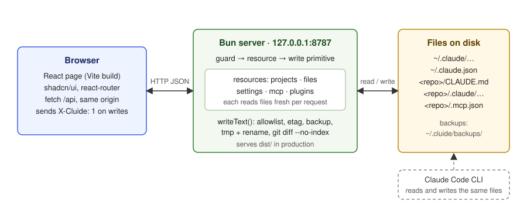

# Foundation

Status: Draft · Planned · 2026-09-12 · The stack, repository shape and safety rules every part of cluide builds on.

## At a glance

cluide is a small web page served by a local process. The page runs in your browser. The process
runs on your machine as you, and reads and writes the real files Claude Code uses: everything under
`~/.claude`, the state file `~/.claude.json`, and each project's `CLAUDE.md`, `.claude/` and
`.mcp.json`. There is no database and no login. Every write goes through one function that backs
the file up, writes atomically, detects conflicts and returns a diff. The server only accepts
writes from the cluide page itself, because those files control what Claude Code executes.

## Diagram



The browser talks JSON to the Bun server on `127.0.0.1:8787`. The server exposes one resource per
kind of thing (projects, files, settings, MCP servers, plugins). Every resource reads files fresh on
each request and writes through the single write primitive. Claude Code reads and writes the same
files on its own schedule, which is why conflict detection exists.

## Principles

- **The files are the source of truth.** No cache, no database. Every screen reads from disk on
  load and writes back to the same file Claude Code reads.
- **Every write is safe.** Backup, atomic rename, conflict detection, diff. One code path, no
  exceptions. See [`write-safety.md`](./write-safety.md).
- **Scope is first-class.** Everything that exists at both user and project level takes a `scope`
  from day one. See [`file-map.md`](./file-map.md).
- **Typed only where merging is needed.** Text files get one generic resource. Settings, MCP and
  plugins get typed resources because their view spans several files. See [`api`](../api/README.md).
- **Localhost is not a trust boundary.** Writes are guarded against cross-site requests even though
  there is no auth. See [`security.md`](./security.md).

## Stack

| Layer | Choice | Why |
|---|---|---|
| API server | Bun, `Bun.serve`, TypeScript | The standard library covers files, JSON, routing and spawning `git`. No Express. |
| Frontend build | Vite | The shadcn CLI detects it, Tailwind is one plugin, every example on the internet matches. Bun's own HTML imports would also work; Vite is the mainstream path. |
| UI | React 19, Tailwind v4, shadcn/ui, lucide icons | shadcn requires React. Tailwind v4 is what current shadcn targets. |
| Routing | react-router | Per-screen URLs that carry the scope, deep links, back and forward. |
| Validation | ajv | `settings.json` has a published JSON schema on SchemaStore (142 properties). |
| Diff | `git diff --no-index` via `Bun.spawn` | Always present on a dev box; no diff library. |
| Tests | `bun test` for server modules | Playwright smoke test later. |

Not used, on purpose: Next, TanStack Query, a form library, a state library, a database. Each is
added when a concrete need appears, not before.

## Repository layout

```
cluide/
  package.json            # single package; scripts: dev, build, start, test
  vite.config.ts          # @tailwindcss/vite; proxy /api -> 127.0.0.1:8787 with changeOrigin
  tsconfig.json           # paths: @/* -> src/*, @shared/* -> shared/*
  components.json         # shadcn
  CLAUDE.md, .claude/rules/
  docs/                   # adr/, spec/, plans/, nice-to-have.md
  shared/
    api.ts                # request/response types; mirrors docs/spec/api, the spec wins on conflict
  server/
    index.ts              # Bun.serve, route table, static dist/, --open, --port
    security.ts           # host + origin + header guard for mutating requests
    paths.ts              # roots, scope -> file paths, allowlist check
    fs.ts                 # readText, writeText (backup, atomic, etag, diff)
    schema.ts             # settings schema fetch, disk cache, ajv validate
    resources/
      projects.ts, files.ts, settings.ts, mcp.ts, plugins.ts
  src/
    main.tsx, App.tsx, router.tsx
    api/client.ts         # fetch wrapper: X-Cluide header, etag, error shape
    components/ui/        # shadcn (generated)
    components/           # AppSidebar, ScopeSwitcher, SaveBar, DiffView
    features/             # one folder per screen: files/, settings/, mcp/, plugins/
```

Rules for growth: one folder per screen under `features/`; one module per resource under
`server/resources/`; both sides import types only from `shared/api.ts`.

## Topic files

| File | What it covers |
|---|---|
| [`file-map.md`](./file-map.md) | Every path cluide reads or writes, per scope, and the ones it never touches. |
| [`write-safety.md`](./write-safety.md) | The single write primitive: allowlist, etag, backup, atomic rename, diff. With the save-flow SVG. |
| [`security.md`](./security.md) | Threat model, the guards on every mutating request, and what is deliberately not defended. |
| [`dev-and-build.md`](./dev-and-build.md) | Scripts, ports, the Vite proxy, production serving. |
| [`testing.md`](./testing.md) | What `bun test` covers and how tests stay off the real `~/.claude`. |

## Open questions

None.
