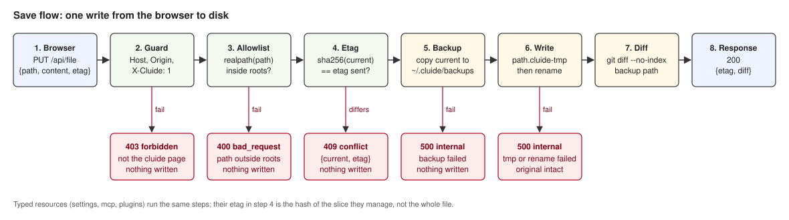

# Write safety

Status: Stable · Planned · 2026-09-12 · The single function every write goes through, and what it guarantees.

## At a glance

cluide edits files that Claude Code may read at any moment and that the user may also edit by
hand. So a write must never leave a half-written file, must never silently overwrite a change made
elsewhere, must always be reversible, and must show the user what changed. All four come from one
function, `writeText`, in `server/fs.ts`. Every resource calls it; nothing writes a file any other
way.

Decided in: [`2026-09-12-one-write-primitive.md`](../../adr/2026-09-12-one-write-primitive.md).

## Diagram



## The primitive

```
writeText(path, content, expectedEtag?) -> { etag, diff }
```

| Step | What happens | On failure |
|---|---|---|
| 1. Allowlist | `realpath` the target and check it against the roots (below). Symlinks are resolved first. | `400 bad_request`, nothing written |
| 2. Conflict check | `etag = sha256(currentContent)`. If the caller sent an etag and it differs, stop. | `409 conflict` with the current content and etag |
| 3. Backup | Copy the current file to `~/.cluide/backups/<encoded path>/<ISO timestamp>`. Keep the last 50 per file. | `500 internal`, nothing written. A write that cannot be backed up does not happen. |
| 4. Atomic write | Write to `<path>.cluide-tmp` in the same directory, then `rename`. | `500 internal`; the original is intact |
| 5. Diff | `git diff --no-index --no-color <backup> <path>`. Exit code 1 means "differences", not failure. | Diff is empty; the write still succeeded |

A file that does not exist yet skips steps 2 and 3 and diffs against `/dev/null`.

## Allowlist roots

| Scope | Allowed |
|---|---|
| global | Anything under `~/.claude/`, plus `~/.claude.json` |
| project | Only `CLAUDE.md`, `CLAUDE.local.md`, `.mcp.json`, and files under `.claude/`, beneath a project root listed in `~/.claude.json` |

Project scope is never "anywhere under the project". The home directory itself is a registered
project on the reference machine, so that rule would have made the allowlist all of `$HOME`.

## Etags

The etag is a content hash, not a modification time. Modification times are unreliable across
editors and file systems; a hash says exactly whether the bytes you loaded are the bytes on disk.

Typed resources hash the **slice they manage**, not the whole file. The MCP resource's etag for
user-scope servers is `sha256(JSON.stringify(json.mcpServers))`. The plugins resource hashes
`enabledPlugins`. So Claude Code touching another key in the same file does not block the save,
while a real conflict on the same slice still returns `409`.

## JSON files

Written with `JSON.stringify(value, null, 2)` plus a trailing newline. `JSON.parse` preserves key
order, so keys stay where the user put them. None of these files support comments, so nothing is
lost by parsing and re-serialising.

## Backups

`~/.cluide/backups/` rather than `~/.claude/backups/`, because that directory belongs to Claude
Code. The encoded path replaces `/` with `-`, matching Claude Code's own convention for
`~/.claude/projects/`. The edit history screen in [`nice-to-have.md`](../../nice-to-have.md) reads
this directory.

## Open questions

None.
