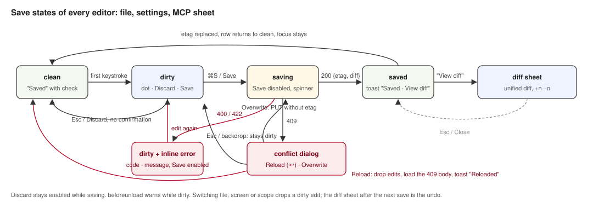

# Editing

Status: Stable · Built · 2026-09-15 · The file editor shared by memory, rules, agents, skills, commands, hook scripts and keybindings, and the save experience every editor in cluide follows.

## At a glance

A files screen is a 240px list on the left and an editor on the right. The list comes from
`GET /api/files?scope&kind`; the editor is a monospace textarea with a 40px header that carries the
file name, its path and the save bar. Saving is `PUT /api/file` with the etag from load; the reply's
diff is one click away in a sheet; a `409` opens the conflict dialog. The same save bar, the same
states and the same dialogs are reused by the settings editor and the MCP server sheet.

## Diagram

## The list

240px, 1px right border, flex column.

- **Filter**, only when the list holds more than 12 entries: padding 8px 8px 0, a 28px input with
  1px `--input`, radius 4px, `Search` icon and placeholder `Filter`, 12px. Filters by name,
  case-insensitive. The footer then shows the count, 28px, 11px muted, 1px top border: `34 skills`.
- **Items** 32px, gap 8px, padding 0 8px, radius 4px, `min-width: 0`: icon muted (`FileText`;
  `Folder` for skills; `FileCode` for hook scripts), then the name with ellipsis. Skills show the
  folder name and `/SKILL.md` muted after it. Selected: `--accent` plus inset bar. Hover: `--accent`.
  `j`/`k` move the selection; clicking selects.
- **Loading**: six skeleton rows, 32px, a 16px square and a bar of 62, 48, 71, 55, 40 and 66 percent
  width, `--muted`, pulsing at 1.6s.
- **New file**, after the header's primary button: an input row at the top of the list, padding
  8px 8px 0, 32px, 1px `--ring` border, radius 4px, `--background`: `FileText` icon, a mono 12px
  input with placeholder `name` and focus, and the fixed suffix in mono 12px muted: `.md`, or
  `/SKILL.md` for skills, or `.sh` for hook scripts. `↵` creates through `POST /api/file` with the
  name plus suffix (for a skill, `<name>/SKILL.md`), selects it, and toasts `Created <name>` with
  the full path. `Esc` cancels. Memory and keybindings have no new-file action.

## The editor

- **Header** 40px, padding 0 16px, gap 12px, 1px bottom border: file name in 500, the full path in
  mono 12px muted with ellipsis, a spacer, the save bar, and for kinds other than memory and
  keybindings a 28×28 `Trash2` button that opens the delete dialog.
- **Save bar**, 40px row, never shifts layout:
  - clean: `Check` and `Saved`, 12px muted.
  - dirty: a 6px dot and `Unsaved changes` in 12px muted, a ghost `Discard` button with an `Esc` kbd,
    a primary `Save` button with a `⌘S` kbd.
  - saving: `Save` at 60% opacity, disabled, with a spinning `LoaderCircle`; `Discard` stays in
    place and enabled. The textarea stays editable; keystrokes during a save leave the editor dirty
    after it.
- **Frontmatter summary**, for agents and skills whose content starts with a `---` block: a 32px row
  under the header, 12px, 1px bottom border: `name` in mono foreground, `description` muted with
  ellipsis, a spacer, and a `frontmatter` pill, 11px, 1px `--border`, radius 4px. Read only.
- **Textarea**: fills the rest, padding 12px 16px, mono 12.5px / 20px, `tab-size: 2`, no resize, no
  spellcheck, transparent background, focus on open. First keystroke makes the editor dirty.
- **Inline error**, under the textarea after a `400` or `422`: padding 6px 16px, 1px top border,
  `--destructive` 12px: `CircleAlert`, the status code in 500, `·`, the server message in mono. The
  content stays editable and `Save` is enabled again.

## States

| State | What shows |
|---|---|
| Fixed file missing (`CLAUDE.md`, `CLAUDE.local.md`, `keybindings.json` with `exists: false`) | The editor area centred: `FileText` muted, `<name> does not exist in this scope` in 500, the path in mono 12px muted, a primary `Create <name>`. Create opens an empty editor already dirty with `# <scope>` and a blank line; the first save does `POST /api/file` and toasts `Created <name>` with the path, since a create returns no diff. |
| Empty directory | Centred: `No <kind> in this scope` in 500, the directory path in mono 12px muted, a secondary `Plus` `New <kind>` button. |
| Nothing selected in a non-empty list | The first file is selected on load. |
| Unreachable server | The offline banner from [`shell.md`](./shell.md) and the loading skeletons stay. |

## Diff sheet

Opened by the `View diff` toast action. A right Sheet, 520px, `--background`, 1px left border,
`--shadow`, overlay `.3`. Header padding 14px 16px 12px: `Diff · <file>` in 500, the path in mono
12px muted, a 28×28 `X`. Body padding 8px 0, mono 12px / 20px, one row per line of the server's
unified diff: old line number and new line number in two 40px right-aligned gutters at 70% opacity,
a 14px sign column, the text in `white-space: pre`. Added lines on `--diff-add`, removed on
`--diff-del`, the `---`, `+++` and `@@` lines muted. Footer padding 12px 16px, 12px muted:
`+<n>` in `--success`, `−<n>` in `--destructive`, `· backup in ~/.cluide/backups`, a spacer, a
secondary `Close`. `Esc` closes. The page parses the diff: hunk headers give the starting numbers,
`+` advances the new counter, `-` the old, context both.

## Conflict dialog

Opened when a save returns `409`. Overlay `.45`. Dialog 440px, `--popover`, 1px `--border`, radius
8px, `--shadow`. Title 14px 600: `TriangleAlert` in `--warning`, the file name in mono, `changed on
disk`. Body 13px muted: `Another process wrote <path> after you opened it. Reload drops your edits
and loads the file. Overwrite replaces what is on disk with your version.` with `Reload` and
`Overwrite` in foreground. Footer, 1px top border, padding 12px 16px: a spacer, a secondary
`Overwrite`, a primary `Reload` with an `↵` kbd that has focus. The dirty save bar stays visible
behind the dialog.

- Reload: drops the edits, loads the current content and etag from the `409` body, toasts
  `Reloaded <file> from disk`.
- Overwrite: `PUT` again without an etag, then the normal saving path.
- `Esc` or the backdrop: closes, editor stays dirty, nothing written.

## Delete dialog

From the header's trash button, or the sheet's `Delete`. Dialog 440px. Title `Delete <name>?` with
the name in mono. Body: `This removes <path> from disk.` (for a server: `This removes the server from
<file>.`) `A copy is kept in ~/.cluide/backups.` Footer, right-aligned: secondary `Cancel` with
focus, destructive `Delete`. Delete calls `DELETE /api/file?path&etag`, selects the next file,
toasts `Deleted <name>` with `backup in ~/.cluide/backups`. A failed delete keeps the dialog open
and shows `Delete failed · <status> · <message>` in 12px `--destructive` under the body; no toast,
since an open dialog hides one from assistive technology. Changes:
[`2026-09-15-pre-release-refinements.md`](../../adr/2026-09-15-pre-release-refinements.md).

## Behaviour rules

- `beforeunload` warns while any editor is dirty.
- `Esc` with nothing floating discards edits without confirmation.
- Switching file, screen or scope drops a dirty edit without asking.
- A save carries the etag from load. After success the new etag replaces it and a `Saved` toast
  offers the diff. Focus stays in the textarea.
- `⌘S` while clean does nothing.

## Open questions

None.
